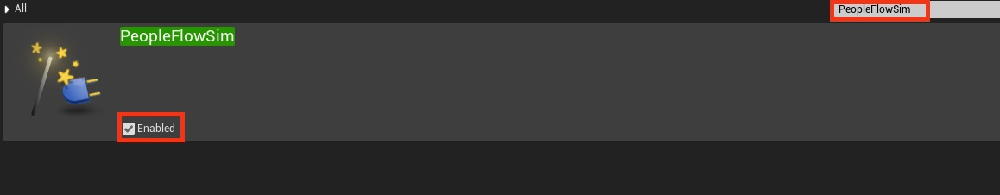
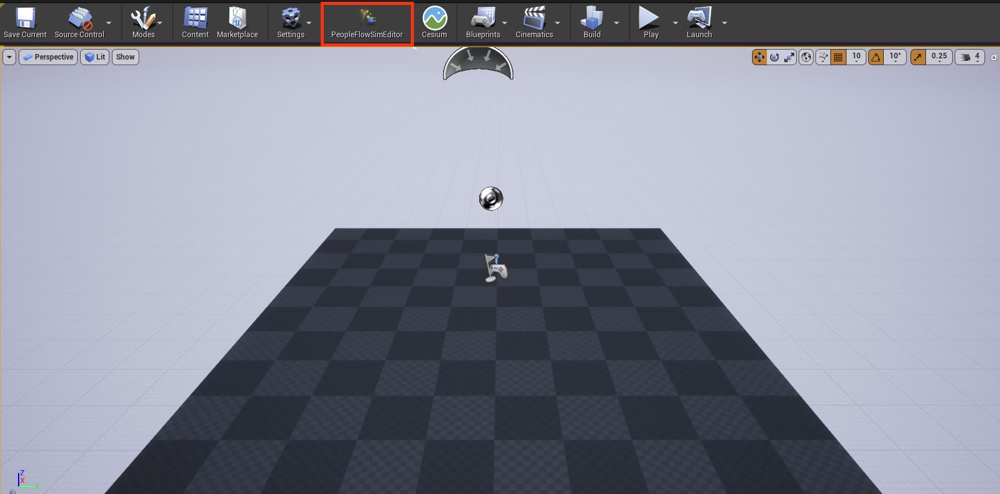

# プラグインのインストール

このドキュメントでは、本プラグインのインストール方法について説明します。  

以下の内容について説明します。

- 前提条件
- インストール手順

## 前提条件

- シミュレーションを行いたいプロジェクトにCesium For Unreal v1.24.0(UE4)がインストールされていること
  - Cesium For Unrealの[GitHubにある手順](https://github.com/CesiumGS/cesium-unreal?tab=readme-ov-file#package-installing-cesium-for-unreal)に従ってインストール
  - [Cesium For Unrealリリースページ](https://github.com/CesiumGS/cesium-unreal/releases/tag/v1.24.0-ue4)

## インストール手順

1. 本プラグインのダウンロード
   - 本リポジトリの `Releases` よりダウンロードが可能です  
      - 対象ファイル： PeopleFlowSim_v1_0_0.zip  
2. UnrealEngine本体の`Engine\Plugins`にダウンロードしたプラグインを解凍
   - UnrealEngineのインストール先がデフォルトの場合、`C:\Program Files\Epic Games\UE_4.27\Engine\Plugins`に解凍
   - 解凍後、PeopleFlowSimフォルダが以下のフォルダ構成になっていることを確認  
```text
PeopleFlowSim
├───Binaries
├───Content
├───Intermediate
├───Resources
├───Source
└───PeopleFlowSim.uplugin
```
3. プロジェクトを起動し、エディター上部のEdit>Pluginsからプラグインウィンドウを表示
4. プラグイン一覧から本プラグインである`PeopleFlowSim`を検索し、`Enabled`とあるチェックボックスにチェックを入れる
   - プラグイン検索結果  
     
5. チェックを入れた後、エディターを再起動
6. 再起動後、上部パネルに`PeopleFlowSimEditor`が表示されていることを確認
   