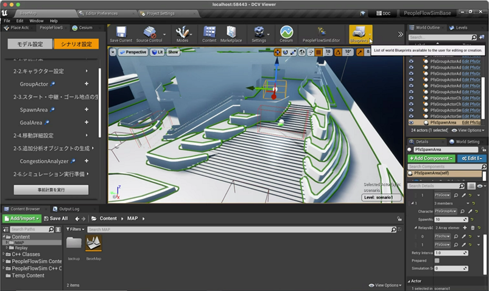
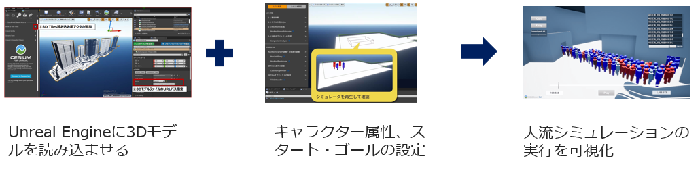
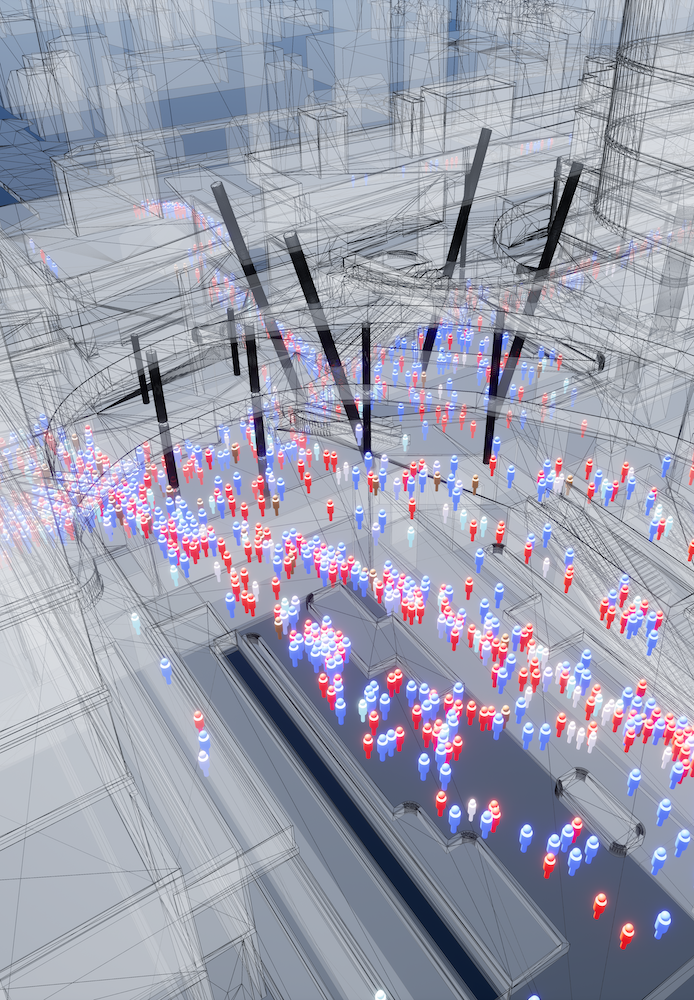

# 人流シミュレーションプラグイン

## 人流シミュレーションプラグインとは
人流シミュレーションプラグイン（以下「本プラグイン」という。）は、1万人規模のシミュレーションを実行するために必要な機能を提供します。
また、本プラグインが提供するGUIを利用することで、専門の技術者以外でもシミュレーションの実行が行えるようになっています。

本プラグイン導入後の画面    


## 機能概要
本プラグインは1万人規模の人流シミュレーションを実行するためのツールです。本プラグインには主に次に示す5つの機能が含まれています。  

* **シナリオ設定をサポートするGUI：** シナリオの設定から実行までをサポートするGUIを提供します。GUIに沿って操作することでシミュレーション実行に必要なシナリオ設定が容易に行えます。

* **シナリオ設定機能：** シナリオ設定に必要な、キャラクター設定、人流定義、行動定義、経路定義を行える機能。  

* **人流シミュレーション実行機能：** 経路探索、衝突検知・回避などシミュレーション実行時にキャラクターを制御する機能。  

* **リプレイ機能：** シミュレーション結果を共有するためのリプレイアプリを作成する機能。  

* **ログ出力及び分析機能：** 人流の密集度計測、移動キャラクターの移動軌跡、移動開始から完了までの時間計測等、シミュレーション結果を分析する機能。  

詳細は、本プラグインに附随するドキュメントを参照してください。

## シミュレーションシナリオ実行までの流れ

シミュレーション実行の流れ  


シミュレーション実行による人流の可視化の様子  


## 本プラグインの構成
```
└── PeopleFlowSim
    ├── Binaries
    ├── Content
    ├── Intermediate
    ├── Resources
    ├── Source
    └── PeopleFlowSim.uplugin
```

### 更新履歴
| 更新日時       | リリース                                                                                                                                                                                                                           | 更新内容                                                                                                                                                                                                               |
|:-----------|:-------------------------------------------------------------------------------------------------------------------------------------------------------------------------------------------------------------------------------|:-------------------------------------------------------------------------------------------------------------------------------------------------------------------------------------------------------------------|
| 2025/03/31 | **1st Release**                                                                                                                                                                                                                | v1.0.0 リリース                                                        |

## 推奨環境
本プラグインは以下の環境で動作確認されています。その他の環境でも動作する可能性はありますが、同等環境での利用を推奨いたします。  

```
OS: Windows10以降  
プロセッサ: AMD Ryzen9 5950X 16Core Processor 3.40GHz  
メモリ: 128GB  
グラフィックカード: NVIDIA GeForce RTX 3080  
```

## 本プラグインインストール手順
[こちら](./Documentation/install.md) のインストール手順をご確認ください。

### 操作方法
操作方法に関しては、上述の本プラグインインストール手順を実行後、本プラグインからマニュアルを表示できますのでご確認をお願いいたします。

## ソフトウェアライセンス（利用規約）
[LICENSE.txt](./LICENSE.txt) こちらのリンクより必ずご確認ください。  
ご利用にあたっては利用規約に同意いただいたものとみなします。  
営利・非営利を問わず事業利用をする場合、別途KDDI株式会社との間で、本プラグインの利用許諾契約（有償）を締結しなければなりません。

## 本プラグインに関するお問い合わせ
準備中
